# aider is GPT powered coding in your terminal

`aider` is a command-line chat tool that allows you to write and edit
code with OpenAI's GPT models.  You can ask GPT to help you start
a new project, or modify code in your existing git repo.
Aider makes it easy to
[git commit, diff & undo changes](https://aider.chat/docs/faq.html#how-does-aider-use-git)
proposed by GPT without copy/pasting.
It also has features that [help GPT-4 understand and modify larger codebases](https://aider.chat/docs/ctags.html).

<p align="center">
  
</p>

<p align="center">
  <a href="https://discord.gg/SqzfE6bw">
    
  </a>
</p>

- [Getting started](#getting-started)
- [Example chat transcripts](#example-chat-transcripts)
- [Features](#features)
- [Usage](#usage)
- [In-chat commands](#in-chat-commands)
- [Tips](#tips)
- [GPT-4 vs GPT-3.5](https://aider.chat/docs/faq.html#gpt-4-vs-gpt-35)
- [Installation](https://aider.chat/docs/install.html)
- [FAQ](https://aider.chat/docs/faq.html)

## Getting started

See the
[installation instructions](https://aider.chat/docs/install.html)
for more details, but you can
get started quickly like this:

```
$ pip install aider-chat
$ export OPENAI_API_KEY=your-key-goes-here
$ aider hello.js

Using git repo: .git
Added hello.js to the chat.

hello.js> write a js app that prints hello world
```

## Example chat transcripts

Here are some example transcripts that show how you can chat with `aider` to write and edit code with GPT-4.

* [**Hello World Flask App**](https://aider.chat/examples/hello-world-flask.html): Start from scratch and have GPT create a simple Flask app with various endpoints, such as adding two numbers and calculating the Fibonacci sequence.

* [**Javascript Game Modification**](https://aider.chat/examples/2048-game.html): Dive into an existing open-source repo, and get GPT's help to understand it and make modifications.

* [**Complex Multi-file Change with Debugging**](https://aider.chat/examples/complex-change.html): GPT makes a complex code change that is coordinated across multiple source files, and resolves bugs by reviewing error output and doc snippets.

* [**Create a Black Box Test Case**](https://aider.chat/examples/add-test.html): GPT creates a "black box" test case without access to the source of the method being tested, using only a
[high level map of the repository based on ctags](https://aider.chat/docs/ctags.html).

You can find more chat transcripts on the [examples page](https://aider.chat/examples/).

## Features

* Chat with GPT about your code by launching `aider` from the command line with set of source files to discuss and edit together. Aider lets GPT see and edit the content of those files.
* GPT can write and edit code in most popular languages: python, javascript, typescript, html, css, etc.
* Request new features, changes, improvements, or bug fixes to your code. Ask for new test cases, updated documentation or code refactors.
* Aider will apply the edits suggested by GPT directly to your source files.
* Aider will [automatically commit each changeset to your local git repo](https://aider.chat/docs/faq.html#how-does-aider-use-git) with a descriptive commit message. These frequent, automatic commits provide a safety net. It's easy to undo changes or use standard git workflows to manage longer sequences of changes.
* You can use aider with multiple source files at once, so GPT can make coordinated code changes across all of them in a single changeset/commit.
* Aider can [give *GPT-4* a map of your entire git repo](https://aider.chat/docs/ctags.html), which helps it understand and modify large codebases.
* You can also edit files by hand using your editor while chatting with aider. Aider will notice these out-of-band edits and ask if you'd like to commit them. This lets you bounce back and forth between the aider chat and your editor, to collaboratively code with GPT.


## Usage

Run the `aider` tool by executing the following command:

```
aider <file1> <file2> ...
```

If your pip install did not place the `aider` executable on your path, you can invoke aider like this:

```
python -m aider.main <file1> <file2>
```

Replace `<file1>`, `<file2>`, etc., with the paths to the source code files you want to work on.
These files will be "added to the chat session", so that GPT can see their contents and edit them according to your instructions.

You can also just launch `aider` anywhere in a git repo without naming
files on the command line.  It will discover all the files in the
repo.  You can then add and remove individual files in the chat
session with the `/add` and `/drop` chat commands described below.
If you or GPT mention one of the repo's filenames in the conversation,
aider will ask if you'd like to add it to the chat.

Aider will work best if you think about which files need to be edited to make your change and add them to the chat.
Aider has some ability to help GPT figure out which files to edit all by itself, but the most effective approach is to explicitly add the needed files to the chat yourself.

Aider also has many
additional command-line options, environment variables or configuration file
to set many options. See `aider --help` for details.

## In-chat commands

Aider supports commands from within the chat, which all start with `/`. Here are some of the most useful in-chat commands:

* `/add <file>`: Add matching files to the chat session.
* `/drop <file>`: Remove matching files from the chat session.
* `/undo`: Undo the last git commit if it was done by aider.
* `/diff`: Display the diff of the last aider commit.
* `/run <command>`: Run a shell command and optionally add the output to the chat.
* `/help`: Show help about all commands.


## Tips

* Think about which files need to be edited to make your change and add them to the chat.
Aider has some ability to help GPT figure out which files to edit all by itself, but the most effective approach is to explicitly add the needed files to the chat yourself.
* Large changes are best performed as a sequence of thoughtful bite sized steps, where you plan out the approach and overall design. Walk GPT through changes like you might with a junior dev. Ask for a refactor to prepare, then ask for the actual change. Spend the time to ask for code quality/structure improvements.
* Use Control-C to safely interrupt GPT if it isn't providing a useful response. The partial response remains in the conversation, so you can refer to it when you reply to GPT with more information or direction.
* Use the `/run` command to run tests, linters, etc and show the output to GPT so it can fix any issues.
* Use Meta-ENTER (Esc+ENTER in some environments) to enter multiline chat messages. Or enter `{` alone on the first line to start a multiline message and `}` alone on the last line to end it.
* If your code is throwing an error, share the error output with GPT using `/run` or by pasting it into the chat. Let GPT figure out and fix the bug.
* GPT knows about a lot of standard tools and libraries, but may get some of the fine details wrong about APIs and function arguments. You can paste doc snippets into the chat to resolve these issues.
* [Aider will notice if you launch it on a git repo with uncommitted changes and offer to commit them before proceeding](https://aider.chat/docs/faq.html#how-does-aider-use-git).
* GPT can only see the content of the files you specifically "add to the chat". Aider also sends GPT-4 a [map of your entire git repo](https://aider.chat/docs/ctags.html). So GPT may ask to see additional files if it feels that's needed for your requests.
* I also shared some general [GPT coding tips on Hacker News](https://news.ycombinator.com/item?id=36211879).


## GPT-4 vs GPT-3.5

Aider supports all of OpenAI's chat models.
You can choose a model with the `--model` command line argument.

You should probably use GPT-4 if you can. For more details see the
[FAQ entry that compares GPT-4 vs GPT-3.5](https://aider.chat/docs/faq.html#gpt-4-vs-gpt-35).

For a discussion of using other non-OpenAI models, see the
[FAQ about other LLMs](https://aider.chat/docs/faq.html#can-i-use-aider-with-other-llms-local-llms-etc).

## Installation

See the [installation instructions](https://aider.chat/docs/install.html).

## FAQ

For more information, see the [FAQ](https://aider.chat/docs/faq.html).

## Kind words from users

* *The best AI coding assistant so far.* -- [Matthew Berman](https://www.youtube.com/watch?v=df8afeb1FY8)
* *Hands down, this is the best AI coding assistant tool so far.* -- [IndyDevDan](https://www.youtube.com/watch?v=MPYFPvxfGZs)
* *Aider ... has easily quadrupled my coding productivity.* -- [SOLAR_FIELDS](https://news.ycombinator.com/item?id=36212100)
* *It's really like having your senior developer live right in your Git repo - truly amazing!* -- [rappster](https://github.com/paul-gauthier/aider/issues/124)
* *What an amazing tool. It's incredible.* -- [valyagolev](https://github.com/paul-gauthier/aider/issues/6#issue-1722897858)
* *Aider is such an astounding thing!* -- [cgrothaus](https://github.com/paul-gauthier/aider/issues/82#issuecomment-1631876700)
* *It was WAY faster than I would be getting off the ground and making the first few working versions.* -- [Daniel Feldman](https://twitter.com/d_feldman/status/1662295077387923456)
* *This project is stellar.* -- [funkytaco](https://github.com/paul-gauthier/aider/issues/112#issuecomment-1637429008)
* *Amazing project, definitely the best AI coding assistant I've used.* -- [joshuavial](https://github.com/paul-gauthier/aider/issues/84)
