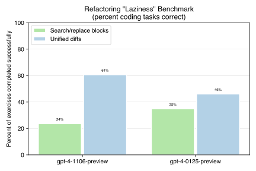

# Code editing benchmarks for OpenAI's "1106" models

[OpenAI just released a new version of GPT-4 Turbo](https://openai.com/blog/new-embedding-models-and-api-updates).
This new model is intended to reduce the "lazy coding" that has been widely observed with the previous `gpt-1106-preview` model:

> Today, we are releasing an updated GPT-4 Turbo preview model, gpt-4-0125-preview. This model completes tasks like code generation more thoroughly than the previous preview model and is intended to reduce cases of “laziness” where the model doesn’t complete a task.

With that in mind, I've been benchmarking the new model using
aider's existing
[lazy coding benchmark](https://aider.chat/docs/unified-diffs.html).

## Benchmark results

**These results are currently preliminary, and will be updated as additional benchmark runs complete.**

The new `gpt-4-0125-preview` model produces mixed results on the
lazy coding benchmark as compared to the November `gpt-4-1106-preview` model:

- It performs much worse when using the [unified diffs](https://aider.chat/docs/unified-diffs.html) code editign format.
- Using aider's older SEARCH/REPLACE block editing format, the new January model outperfoms the older November model. But it still performs worse than both models using unified diffs.

## Related reports

This is one in a series of reports
that use the aider benchmarking suite to assess and compare the code
editing capabilities of OpenAI's GPT models.
You can review the other reports
for additional information:

- [GPT code editing benchmarks](https://aider.chat/docs/benchmarks.html) evaluates the March and June versions of GPT-3.5 and GPT-4.
- [Code editing benchmarks for OpenAI's "1106" models](https://aider.chat/docs/benchmarks-1106.html).
- [Aider's lazy coding benchmark](https://aider.chat/docs/unified-diffs.html).

## Updates

Last updated 11/14/23.
OpenAI has relaxed rate limits so these results are no longer considered preliminary.
