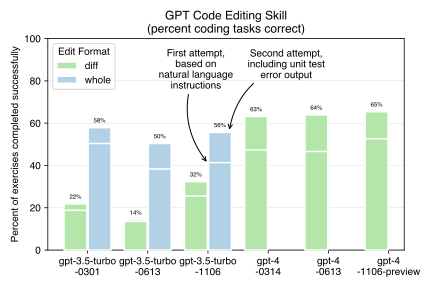

# Code editing benchmarks for OpenAI's "1106" models

Aider is an open source command line chat tool that lets you work with GPT to edit
code in your local git repo.
To do this, aider needs to be able to reliably recognize when GPT wants to edit local files,
determine which files it wants to modify and what changes to make.

Doing a good job on this "code editing" task required a good LLM, good prompting and
a good tool driving the interactions with the LLM.
Aider uses a
[benchmark to quantitatively evaluate code editing](https://aider.chat/docs/benchmarks.html)
whenever one of these things changes.
For example,
whenever I change aider's prompting or the backend which drives LLM conversations,
I run the benchmark to make sure these changes produce improvements (not regressions).

The benchmark asks GPT to complete the
[Exercism Python coding exercises](https://github.com/exercism/python).
Exercism provides a starting python file with stubs for the needed functions,
a natural language description of the problem to solve
and a test suite to evaluate whether the coder has correctly solved the problem.

The benchmark that aider uses gives GPT two tries to complete the task:

1. On the first try, GPT is given the stub code file to edit and the natural language instructions that describe the problem.
2. If the test suite fails after the first try, GPT gets to see the test error output and has a second chance to fix the code. Aider supports this sort of interaction when chatting with GPT by letting users `/run pytest` and share the results in the chat. You can `/run` whatever tests/linters/etc make sense for your language/framework/situation.

[OpenAI just released new versions of GPT-3.5 and GPT-4](https://openai.com/blog/new-models-and-developer-products-announced-at-devday),
and there's a lot
of interest about their ability to code compared to the previous versions.
With that in mind, I've been benchmarking the new models.

## gpt-4-1106-preview

- The new `gpt-4-1106-preview` model seems **much faster** than the earlier GPT-4 models! I won't be able to properly quantify this until the rate limits loosen up. Currently I am seeing 10X faster responses.
- **It is better at producing correct code on the first try**. It gets ~59% of the coding exercises correct, without needing to see errors from the test suite. Previous models only get 46-47% of the exercises correct on the first try.
- The new model seems to perform similarly to the old models after being given a chance to correct bugs by reviewing test suite error output.

**These results are preliminiary.**
OpenAI is enforcing very low
rate limits on the new GPT-4 model. The limits are so low, that
I have only been able to attempt 56 out of 133 exercism problems.
They are randomly chosen, so results should be *roughly*
indicative of the full benchmark.

## gpt-3.5-turbo-1106

- The new `gpt-3.5-turbo-1106` model is completing the benchmark **3-4X faster** than the earlier GPT-3.5 models.
- The success rate after the first try of 42% is comparable to the previous June (0613) model. They are both worse than the original March (0301) model's 50% result on the first try.
- The 56% success rate after the second try seems comparable to the original March model, and somewhat better than the June model's 50% score.

## Updates

I will update the results on this page as quickly my rate limit allows.
