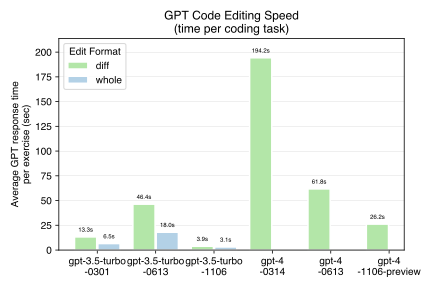

# Code editing speed benchmarks for OpenAI's "1106" models

[OpenAI just released new versions of GPT-3.5 and GPT-4](https://openai.com/blog/new-models-and-developer-products-announced-at-devday),
and there's a lot
of interest about their capabilities and performance.
With that in mind, I've been benchmarking the new models.

[Aider](https://github.com/paul-gauthier/aider)
is an open source command line chat tool that lets you work with GPT to edit
code in your local git repo.
Aider relies on a
[code editing benchmark](https://aider.chat/docs/benchmarks.html)
to quantitatively evaluate
performance.

This is the latest in a series of benchmarking reports
about the code
editing capabilities of OpenAI's GPT models. You can review previous
reports to get more background on aider's benchmark suite:

- [GPT code editing benchmarks](https://aider.chat/docs/benchmarks.html) evaluates the March and June versions of GPT-3.5 and GPT-4.
- [Code editing skill benchmarks for OpenAI's "1106" models](https://aider.chat/docs/benchmarks-1106.html) compares the olders models to the November (1106) models.

## Speed

This report compares the **speed** of the various GPT models.
Aider's benchmark measures the response time of the OpenAI chat completion
endpoint each time it asks GPT to solve a programming exercise in the benchmark
suite. These results measure only the time spent waiting for OpenAI to
respond to the prompt.
So they are measuring
how fast these models can
generate responses which primarily consist of source code.

Some observations:

- **GPT-3.5 got 6-11x faster.** The `gpt-3.5-turbo-1106` model is 6-11x faster than the June (0613) version which has been the default `gpt-3.5-turbo` model.
- **GPT-4 Turbo is 4-5x faster.** The new `gpt-4-1106-preview` model is 4-5x faster than the June (0613) version which has been the default `gpt-4` model.
- The old March (0301) version of GPT-3.5 is actually faster than the June (0613) version. This was a surprising discovery.

### Preliminary results

**These are preliminary results.**
OpenAI is enforcing very low
rate limits on the new GPT-4 model.
The rate limiting disrupts the the benchmarking process,
requiring it to be run single threaded, paused and restarted frequently.
These anomolous conditions make it slow to
benchmark the new model, and make comparisons against
the older versions less reliable.
Once the rate limits are relaxed I will do a clean
run of the entire benchmark suite.

### Updates

I will update the results on this page as quickly as my rate limit allows.
