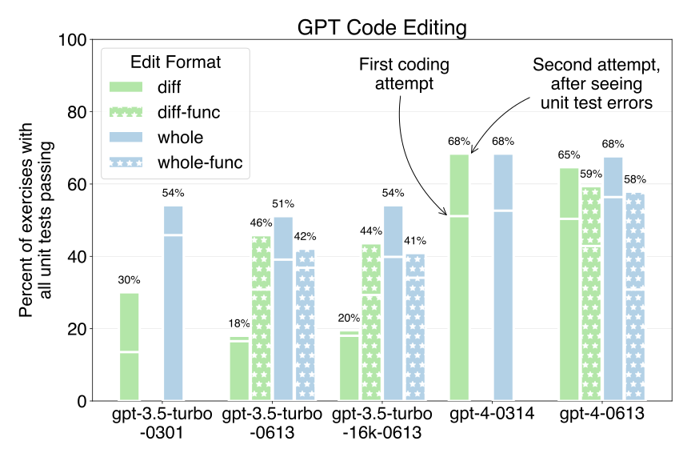

# GPT code editing benchmarks



Aider is an open source command line chat tool that lets you ask GPT to edit
code in your local git repos.
You can use aider to ask GPT to add features, write tests or make other changes and
improvements to your code.

The ability for GPT to reliably edit local source files is
crucial for this functionality.
Much of this depends on the "edit format", which is an important component of the
system prompt.
The edit format specifies how GPT should structure code edits in its
responses.

Aider currently uses simple text based editing formats, but
[OpenAI's new function calling
API](https://openai.com/blog/function-calling-and-other-api-updates)
looks like a promising way to create more structured edit formats.
Before making such a big change, I wanted to make
sure I had a quantitative way to assess the benefits
of function based editing.

With this in mind, I developed a
benchmark based on the [Exercism
python](https://github.com/exercism/python) coding exercises.
This
benchmark evaluates how effectively aider and GPT can translate a
natural language coding request into actual runnable code saved into
files that pass unit tests. It's an end-to-end evaluation of not just
GPT's code writing ability, but also its capacity to *edit existing
code* and *package those code changes* so that aider can save the
edits to the local source files.

I ran this code editing benchmark
on almost all the ChatGPT models, using a variety of edit formats.
The results were quite interesting:

  - Asking GPT to return an updated copy of the whole file in a standard markdown fenced code block proved to be the most reliable and effective edit format across all GPT-3.5 and GPT-4 models. The results from this `whole` edit format are shown in solid blue in the graph.
  - Using the new functions API performed worse than the above whole file method for all models. GPT-3.5 especially produced inferior code and frequently mangled this output format. This was surprising, as the functions API was introduced to enhance the reliability of structured outputs. The results from these `...-func` edit methods are shown as patterned bars in the graph (both green and blue).
  - The performance of the new June (`0613`) version of GPT-3.5 appears to be a bit worse than the February (`0301`) version. This is visible if you look at the "first coding attempt" markers on the first three blue bars.
  - As expected, the GPT-4 models outperformed the GPT-3.5 models in code editing.

The quantitative benchmark results align with my intuitions
about prompting GPT for complex tasks like coding. It's beneficial to
minimize the "cognitive overhead" of formatting the response, allowing
GPT to concentrate on the task at hand. As an analogy, imagine asking a junior
developer to implement a new feature by manually typing the required
code changes as `diff -c` formatted edits. You wouldn't expect a good result.

Using more complex output formats seems to introduce two issues:

  - It makes GPT write worse code. Keeping the output format simple appears to allow GPT to devote more attention to the actual coding task.
  - It reduces GPT's adherence to the output format, making it more challenging for tools like aider to accurately identify and apply the edits GPT is attempting to make.

I was planning to start using a function call based edit format in aider for both GPT-3.5 and GPT-4.
But given these benchmarking results, I won't be adopting the functions API
at this time.

More details on the benchmark, edit formats and results are discussed below.


## The benchmark

The benchmark uses 
[133 practice exercises from the Exercism python repository](https://github.com/exercism/python/tree/main/exercises/practice).
These
exercises were designed to help individuals learn Python and hone
their coding skills.

Each exercise includes:

  - Instructions for the exercise, provided in markdown files.
  - Stub code for the implementation in a python file, specifying the functions/classes that need to be implemented.
  - Unit tests in a seperate python file.

The goal is for GPT to read the instructions, implement the provided functions/class skeletons
and pass all the unit tests. The benchmark measures what percentage of
the 133 exercises are completed successfully, causing all the associated unit tests to pass.

To complete an exercise, aider sends GPT
the initial contents of the implementation file,
the Exercism instructions
and a final instruction:

```
Use the above instructions to modify the supplied files: <implementation file>
Keep and implement the existing function or class stubs, they will be called from unit tests.
Only use standard python libraries, don't suggest installing any packages.
```

Aider updates the implementation file based on GPT's reply and runs
the unit tests. If all tests pass, the exercise is considered
complete. If some tests fail, Aider sends GPT a second message with
the test error output. It only sends the first 50 lines of test errors
to avoid exceeding the context window of the smaller models. Aider
also includes this final instruction:

```
See the testing errors above.
The tests are correct.
Fix the code in <implementation file> to resolve the errors.
```

Requiring GPT to fix its first implementation in response to test failures
is another way in which this benchmark stresses code editing skill.
This second chance is also important because it
gives a chance for GPT to adjust if the
instructions were imprecise with respect to the
specific requirements of the unit tests.
Many of the exercises have multiple paragraphs of instructions,
and most human coders would likely fail some tests on their
first try.

The bars in the graph show the percent of exercises that were completed by
each model and edit format combination. The full bar height represents
the final outcome following the first coding attempt and the second
attempt that includes the unit test error output.
Each bar also has a horizontal mark that shows
the intermediate performance after the first coding attempt,
without the benefit of second try.

It's worth noting that GPT never gets to see the source code of the
unit tests during the benchmarking. It only sees the error output from
failed tests. Of course, all of this code was probably part of its
original training data!

In summary, passing an exercise means GPT was able to:

  - Write the required code (possibly after reviewing test error output),
  - Correctly package all of this code into the edit format so that Aider can process and save it to the implementation file.

Conversely, failing an exercise only requires a breakdown in one of
those steps. In practice, GPT fails at different steps in different
exercises. Sometimes it simply writes the wrong code. Other times, it
fails to format the code edits in a way that conforms to the edit
format, resulting in the code not being saved correctly.

It's worth keeping in mind that changing the edit format often affects
both aspects of GPT's performance.
Complex edit formats often lead to poorer code *and* make it less
successful at formatting the edits correctly.


## Edit formats

I benchmarked 4 different edit formats, described below.
Each description includes a sample response that GPT might provide in response to a user who
requests:
"Change the print from hello to goodbye."

### whole

The
[whole](https://github.com/paul-gauthier/aider/blob/main/aider/coders/wholefile_prompts.py)
format asks GPT to return an updated copy of the entire file, including any changes.
The file should be
formatted with normal markdown triple-backtick fences, inlined with the rest of its response text.

This format is very similar to how ChatGPT returns code snippets during normal chats, except with the addition of a filename right before the opening triple-backticks.

````
Here is the updated copy of your file demo.py:

demo.py
```python
def main():
    print("goodbye")
```
````

### diff

The [diff](https://github.com/paul-gauthier/aider/blob/main/aider/coders/editblock_prompts.py)
format also asks GPT to return edits as part of the normal response text,
in a simple diff format.
Each edit is a fenced code block that
specifies the filename and a chunk of ORIGINAL and UPDATED code.
GPT provides some original lines from the file and then a new updated set of lines.

````
Here are the changes you requested to demo.py:

```python
demo.py
<<<<<<< ORIGINAL
    print("hello")
=======
    print("goodbye")
>>>>>>> UPDATED
```
````

### whole-func

The [whole-func](https://github.com/paul-gauthier/aider/blob/main/aider/coders/wholefile_func_coder.py) 
format requests updated copies of whole files to be returned using the function call API.


```
{
    "explanation": "Changed hello to goodbye.",
    "files": [
        {
            "path": "demo.py",
            "content": "def main():\n    print(\"goodbye\")\n"
        }
}
```

### diff-func

The
[diff-func](https://github.com/paul-gauthier/aider/blob/main/aider/coders/editblock_func_coder.py)
format requests a list of 
original/updated style edits to be returned using the function call API.

```
{
    "explanation": "Changed hello to goodbye.",
    "edits": [
        {
            "path": "demo.py",
            "original_lines": [
                "    print(\"hello\")"
            ],
            "updated_lines": [
                "    print(\"goodbye\")"
            ],
        }
    ]
}       
```

## GPT-3.5's performance

### The `0613` models seem worse?

The benchmark results have me fairly convinced that the new
`gpt-3.5-turbo-0613` and `gpt-3.5-16k-0613` models
are a bit worse at code editing than
the older `gpt-3.5-turbo-0301` model.
This is especially visible in the "first coding attempt"
portion of each result, before GPT gets a second chance to edit the code.
Look at the horizontal white line in the middle of the first three blue bars.

Performance with the `whole` edit format was 46% for the
February model and only 39% for the June models.
I saw other signs of this degraded performance
in earlier versions of the
benchmark as well.

### Pathological use of `diff`

When GPT-3.5 is able to correctly generate the `diff` edit format,
it often uses it in a pathological manner. It places the *entire*
original source file in the ORIGINAL block and the entire updated file
in the UPDATED block. This is strictly worse than just using the
`whole` edit format, as GPT is sending 2 full copies of the file.

### Hallucinated function calls

When GPT-3.5 uses the functions API
it is prone to ignoring the JSON Schema that specifies valid functions.
It often returns a completely novel and semantically
invalid `function_call` fragment with `"name": "python"`.

The `arguments` attribute is supposed to be a set of key/value pairs
with the arguments to the function specified in the `name` field.
Instead, GPT-3.5 frequently just stuffs an entire python
file into that field.

```
        "function_call": {
          "name": "python",
          "arguments": "def main():\n    print(\"hello\")\n"
        },
```

It seems like it might be getting confused by fine-tuning that was
done for the ChatGPT code interpreter plugin?


## Randomness

The benchmark attempts to be deterministic, always sending identical
requests for each exercise on repeated runs.
As part of this effort,
when sending test error output to GPT,
it removes the wall-clock timing information that
is normally included by the `unittest` module.

The benchmarking harness also logs SHA hashes of
all the OpenAI API requests and replies.
This makes it possible to
detect randomness or nondeterminism
in the bechmarking process.

It turns out that the OpenAI chat APIs are not deterministic, even at
`temperature=0`.  The same identical request will produce multiple
distinct responses, usually less than 5-10 variations.  This suggests
that OpenAI may be load balancing their API across a number of
slightly different instances of the model?

For some exercises, some of these variable responses pass the unit tests while
other variants do not. Results for exercises like this, which are
"on the bubble",
are therefore a bit random, depending on which variant OpenAI returns.

Given that, it would be ideal to run all 133 exercises many times for each
model/edit-format combination and report an average performance.
This would average away the effect of the API variance.
It would also significantly increase the cost of this sort of benchmarking.
So I didn't do that.

Benchmarking against 133 exercises provides some robustness all by itself, since
we are measuring the performance across many exercises.

But to get a sense of how much the API variance impacts the benchmark outcomes,
I ran all 133 exercises 10 times each
against `gpt-3.5-turbo-0613` with the `whole` edit format.
You'll see one set of error bars in the graph, which show
the range of results from those 10 runs.

The OpenAI API randomness doesn't seem to
cause a large variance in the overall benchmark results.

## Conclusions

Based on these benchmarking results, aider will continue to use
the `whole` edit format for GPT-3.5, and `diff` for GPT-4.
