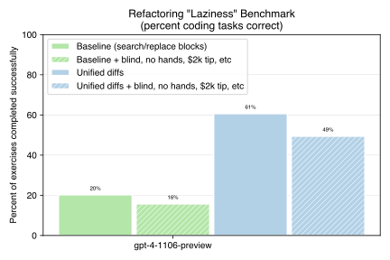

# Fixing GPT-4 Turbo laziness with unified diffs




Aider now asks GPT-4 Turbo to use
[unified diffs](https://www.gnu.org/software/diffutils/manual/html_node/Example-Unified.html)
to edit your code.
This massively reduces GPT-4 Turbo's bad habit of "lazy" coding,
where it writes half completed code filled with comments
like "...add logic here...".

Aider also has a new benchmarking suite 
designed to both provoke and quantify lazy coding.
It consists of
39 python refactoring tasks,
which tend to make GPT-4 Turbo very lazy,
often resulting in comments like
"...include the original method body...".

This new laziness benchmark produced the following results with `gpt-4-1106-preview`:

- **GPT-4 Turbo only scored 15% as a baseline** using aider's existing "SEARCH/REPLACE block" edit format.
- **Aider's new unified diff edit format raised the score to 62%**.
- **No benefit from the user being blind, without hands, tipping $2000 or fearing truncated code trauma.** These widely circulated folk remedies performed no better than baseline when added to the system prompt with aider's SEARCH/REPLACE edit format. Including *all* of them still only scored at 15%

The older `gpt-4-0613` also did better on the laziness benchmark using unified diffs:

- **The June GPT-4's baseline was 26%** using aider's existing "SEARCH/REPLACE block" edit format.
- **Aider's new unified diff edit format raised June GPT-4's score to 59%**. 
- The benchmark was designed to use large files, and
28% of them are too large to fit in June GPT-4's 8k context window.
This significantly harmed the benchmark results.

Before settling on unified diffs,
I explored many other approaches including:
prompts about being tireless and diligent,
OpenAI's function/tool calling capabilities,
numerous variations on aider's existing editing formats,
line number based formats
and other diff-like formats.
The results shared here reflect
an extensive investigation and benchmark evaluations of many approaches.

Aider's new unified diff editing format
outperforms other solutions by a wide margin.
The rest of this article will describe
aider's new editing format and refactoring benchmark.
It will highlight some key design decisions,
and evaluate their significance using ablation experiments.


## Unified diff editing format

The design and implementation of aider's new unified diff editing format
helped clarify some general principles
for GPT-4 code editing:

- FAMILIAR - Choose an edit format that GPT is already familiar with.
- SIMPLE - Choose a simple format that avoids escaping, syntactic overhead and brittle specifiers like line numbers or line counts.
- HIGH LEVEL - Encourage GPT to structure edits as new versions of substantive code blocks (functions, methods, etc), not as a series of surgical/minimal changes to individual lines of code.
- FLEXIBLE - Strive to be maximally flexible when interpreting GPT's edit instructions.

A helpful shortcut here is to have empathy for GPT, and imagine you
are the one being asked to specify code edits.
Would you want to hand type a properly escaped json data structure
to invoke surgical insert, delete, replace operations on specific code line numbers?
How would you feel about any mistake causing all your work to be discarded?

GPT is quantitatively better at code editing when you reduce the
burden of formatting edits by using a familiar, simple, high level
and flexible editing format.

### Choose a familiar editing format

Unified diffs are perhaps the most common way to show
code edits, because it's the 
default output format of `git diff`:

```diff
--- a/hello.py
+++ b/hello.py
@@ -1,5 +1,5 @@
 def main(args):
     # show a greeting
-    print("Hello!")
+    print("Goodbye!")
     return
```

Choosing such a popular format means that GPT has
seen *many* examples in its training data.
It's been trained to generate
text that conforms to the unified diff syntax.

Unified diffs are
usually intended to be consumed by the
[patch](https://www.gnu.org/software/diffutils/manual/html_node/Merging-with-patch.html)
program.
They need to *accurately* reflect the original and updated file contents,
otherwise the patch command will fail.
Having GPT specify changes in a format that is usually consumed by a
rigid program like patch
seems to encourage rigor.
GPT is less likely to
leave informal editing instructions in comments
or be lazy about writing all the needed code.

With unified diffs, GPT acts more like it's writing textual data intended to be read by a program,
not talking to a person.


### Use a simple editing format

Aider's [previous benchmark results](https://aider.chat/docs/benchmarks.html) made
it clear that simple editing formats
work best.
Even though OpenAI provides extensive support for
structured formats like json and function calls,
GPT is worse at editing code if you use them.
I repeated these and other similar benchmarks against GPT-4 Turbo,
and again reached these same conclusions.

Informally, this is probably because stuffing *source code* into JSON is complicated
and error prone.
Wrapping the python code
`print("On Windows use \"C:\\\"")`
as valid json is pretty painful and error prone.
Due to escaping issues GPT's code is often syntactically incorrect when it's
unpacked from JSON,
or the JSON decode just fails entirely.

On the other hand, the core of the unified diff format is very simple.
You include a hunk of the file that needs to be changed,
with every line prefixed by a character
to indicate unchanged, new or deleted lines.
A unified diff looks pretty much like the code it is modifying.

The one complicated piece is the line numbers found at the start
of each hunk. They look something like this: `@@ -2,4 +3,5 @@`.
GPT is terrible at working with source code line numbers.
This is a general observation about *any* use of line
numbers in editing formats,
backed up by many quantitative benchmark experiments.

You've probably ignored the line numbers in every diff you've seen,
because the diffs usually still make sense without them.
Aider tells GPT not to include line numbers,
and just interprets each hunk from the unified diffs
as a search and replace operation:

This diff:

```diff
@@ ... @@
 def main(args):
     # show a greeting
-    print("Hello!")
+    print("Goodbye!")
     return
```

Means we need to search the file for the
*space* and *minus* `-` lines:

```python
def main(args):
    # show a greeting
    print("Hello!")
    return
```

And replace them with the *space* and *plus* `+` lines:

```python
def main(args):
    # show a greeting
    print("Goodbye!")
    return
```

Simple, right?

### Encourage high level edits

The example unified diffs we've seen so far have all been single line changes,
which makes them pretty easy to read and understand.
Consider this slightly more complex change, which renames the variable `n` to
`number`:

```diff
@@ ... @@
-def factorial(n):
+def factorial(number):
-    if n == 0:
+    if number == 0:
         return 1
     else:
-        return n * factorial(n-1)
+        return number * factorial(number-1)
```

The following "high level diff" of the same
change is not as succinct as the minimal diff above,
but it is much easier to see two different coherent versions of the
`factorial()` function.

```diff
@@ ... @@
-def factorial(n):
-    if n == 0:
-        return 1
-    else:
-        return n * factorial(n-1)
+def factorial(number):
+    if number == 0:
+        return 1
+    else:
+        return number * factorial(number-1)
```

Aider's system prompt encourages
GPT to produce these high level diffs.
This makes GPT better at producing correct diffs, which can be successfully
applied to the original file.

**Experiments without "high level diff" prompting
produce a 30-50% increase in editing errors,**
where diffs fail to apply or apply incorrectly and
produce invalid code.
When a patch fails, aider needs to ask GPT for a corrected version of the diff.
This takes time, costs tokens and sometimes fails to produce a successful edit
even after multiple retries.

There are probably a couple of reasons why high level diffs
help:

- It's easier to produce diffs that both correctly match the original code and correctly produce the intended new code. There is less risk of GPT getting confused, compared to generating a series of surgical edits mixed into existing code.
- High level hunks often contain more lines than a surgical hunk, so they are less likely to accidentally match unrelated parts of code. This is helpful because GPT can't reliably give us line numbers to specify exactly where in the file to make changes.

### Be flexible when applying edits

GPT frequently makes imperfect diffs that won't apply cleanly.
They exhibit a variety of problems:

- GPT forgets things like comments, docstrings, blank lines, etc. Or it skips over some code that it doesn't intend to change.
- GPT forgets the leading *plus* `+` character to mark novel lines that it wants to add to the file. It incorrectly includes them with a leading *space* as if they were already there.
- GPT jumps ahead to show edits to a different part of the file without starting a new hunk with a `@@ ... @@` divider.

As an example of the first issue, consider this source code:

```python
import sys

def main(args):
    # show a greeting
    print("Hello!")
    return

main(sys.argv[1:])
```

**The diff below is missing the "show a greeting" comment line**,
and represents a common type of mistake GPT might make.
When we search for the *minus* `-` lines, we won't find them
in the original file
because of the missing comment.


```diff
@@ ... @@
-def main(args):
-    print("Hello!")
-    return
+def main(args):
+    print("Goodbye!")
+    return
```


Aider tries to be very flexible when applying diffs,
in order to handle defects.
If a hunk doesn't apply cleanly, aider uses a number of strategies:

- Normalize the hunk, by taking the *minus* `-` and *space* lines as one version of the hunk and the *space* and *plus* `+` lines as a second version and doing an actual unified diff on them.
- Try and discover new lines that GPT is trying to add but which it forgot to mark with *plus* `+` markers. This is done by diffing the *minus* `-` and *space* lines back against the original file.
- Break a large hunk apart into an overlapping sequence of smaller hunks, which each contain only one contiguous run of *plus* `+` and *minus* `-` lines. Try and apply each of these sub-hunks independently.
- Vary the size and offset of the "context window" of *space*  lines from the hunk that are used to localize the edit to a specific part of the file.
- Combine the above mechanisms to progressively become more permissive about how to apply the hunk.

These flexible patching strategies are critical, and 
removing them
radically increases the number of hunks which fail to apply.

**Experiments where flexible patching is disabled show**:

- **GPT-4 Turbo's performance drops from 65% down to 56%** on the refactoring benchmark.
- **A 9X increase in editing errors** on aider's original Exercism benchmark.

## Refactoring benchmark

Aider has long used a
[benchmark suite based on 133 Exercism python exercises]().
But these are mostly small coding problems,
usually requiring only a few dozen lines of code.
GPT-4 Turbo is typically only lazy on 2-3 of these exercises:
the ones with the most code and which involve refactoring.

Based on this observation, I set out to build a benchmark based on refactoring
a non-trivial amount of code found in fairly large files.
To do this, I used python's `ast` module to analyze the
[Django repository](https://github.com/django/django) to:

- Find source files that contain class methods which are non-trivial, having more than 100 AST nodes in their implementation.
- Focus on methods that are part of a larger class, which has at least twice as much code as the method itself.
- Find methods that don't use their `self` parameter, so they can be trivially refactored out of the class.

We can then turn each of these source files into a task for the benchmark,
where we ask GPT to do something like:

> Refactor the `_set_csrf_cookie` method in the `CsrfViewMiddleware` class to be a stand alone, top level function.
> Name the new function `_set_csrf_cookie`, exactly the same name as the existing method.
> Update any existing `self._set_csrf_cookie` calls to work with the new `_set_csrf_cookie` function.

A [simple python AST scanning script](https://github.com/paul-gauthier/aider/blob/main/benchmark/refactor_tools.py)
found 39 suitable files
and packaged them up as benchmark tasks.
Each task has a test
that checks if refactor
was performed roughly correctly:

- The updated source file must parse as valid python, to surface misapplied edits which corrupt the file.
- The target method must now exist as a top-level function in the file.
- This new top-level function must contain approximately the same number of AST nodes as the original class method. This ensures that GPT didn't elide code and replace it with comments.
- The original class must still be present in the file, and it must be smaller by about the number of AST nodes in the method which was removed. This helps confirm that the method was removed from the class, without other significant modifications.

To be clear, this is not a rigorous test that the refactor was performed correctly.
But it does serve as a basic sanity check that the refactor was essentially done as a cut & paste, without eliding any code as comments.
And it correlates well with other laziness metrics
gathered during benchmarking like the
introduction of new comments that contain "...".

The result is a pragmatic
[benchmark suite that provokes, detects and quantifies GPT coding laziness](https://github.com/paul-gauthier/refactor-benchmark).


## Conclusions and future work

Based on the refactor benchmark results,
aider's new unified diff format seems very effective at stopping
GPT-4 Turbo from being a lazy coder.

Unified diffs was one of the very first edit formats I tried
when originally building aider.
I think a lot of other AI coding assistant projects have also
tried going down this path.
It seems like any naive or direct use of structured diff formats
is pretty much doomed to failure.
But the techniques described here and
incorporated into aider provide
a highly effective way to harness GPT's knowledge of unified diffs.

There could be significant benefits to
fine tuning models on
aider's simple, high level style of unified diffs.
Dropping line numbers from the hunk headers and focusing on diffs of
semantically coherent chunks of code
seems to be an important part of successful GPT code editing.
Most LLMs will have already seen plenty of unified diffs
in their normal training data, and so should be
very amenable to fining tuning towards this
particular diff style.
