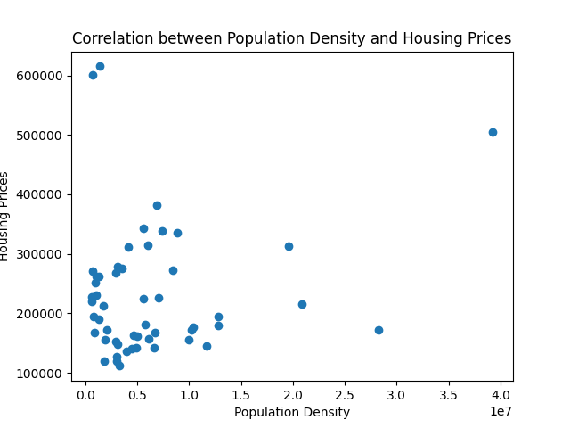

# Download, analyze and plot US Census data

Inspired by
[Ethan Mollick's recent blog article about ChatGPT plugins](https://www.oneusefulthing.org/p/it-is-starting-to-get-strange),
I used `aider` and GPT-4 to do data analysis of some US Census data.
I asked aider how to download census data and to suggest some
hypotheses to test. I asked it to write the code to get the data, test one of the
hypotheses and provide a summary and plot of the results.

<div class="chat-transcript" markdown="1">

> $ aider  
> Using git repo: .git  

#### what is a good basic us census dataset to analyze for interesting patterns?  

A good basic US Census dataset to analyze for interesting patterns is the American Community Survey (ACS) dataset. The ACS is an ongoing survey conducted by the US Census Bureau that provides vital information on a yearly basis about the US population and its characteristics. The dataset includes information on demographics, social, economic, and housing characteristics.

You can find the ACS dataset on the US Census Bureau's website: https://www.census.gov/programs-surveys/acs/data.html

Some interesting patterns to analyze in the ACS dataset could include:

1. Population growth and decline in different regions.
2. Changes in racial and ethnic composition.
3. Income inequality and poverty levels.
4. Educational attainment and its relationship with income.
5. Housing affordability and homeownership rates.

Remember to consider the dataset's documentation and guidelines to understand the data and its limitations.


</div>
<div class="chat-transcript" markdown="1">
#### do you know how to download American Community Survey data?  

Yes, I can guide you on how to download American Community Survey (ACS) data. You can use the Census Bureau's API to access the data. To do this, you'll need an API key, which you can obtain from the Census Bureau's website.

Here's a Python example using the `requests` library to download ACS data:

1. Install the `requests` library if you haven't already:

```
pip install requests
```

2. Use the following code to download ACS data:

```python
import requests

# Replace 'your_api_key' with your actual API key
api_key = 'your_api_key'

# Define the API endpoint and parameters
url = 'https://api.census.gov/data/2019/acs/acs5'
params = {
    'get': 'NAME,B01001_001E',  # Variables to retrieve (NAME: Geographic area name, B01001_001E: Total population)
    'for': 'state:*',  # Geographic area (all states)
    'key': api_key
}

# Send the request and parse the response
response = requests.get(url, params=params)
data = response.json()

# Print the data
for row in data:
    print(row)
```

Replace `'your_api_key'` with the API key you obtained from the Census Bureau's website. This example retrieves the total population (variable `B01001_001E`) for all states. You can modify the `get` and `for` parameters to download different variables and geographic areas.

For more information on available variables and geographic areas, refer to the ACS documentation:

- Variables: https://api.census.gov/data/2019/acs/acs5/variables.html
- Geographic Areas: https://api.census.gov/data/2019/acs/acs5/geography.html


</div>
<div class="chat-transcript" markdown="1">
#### how do i get an api key?  

To obtain an API key from the Census Bureau, follow these steps:

1. Go to the Census Bureau's API key request page: https://api.census.gov/data/key_signup.html

2. Fill out the form with your name, email address, organization (if applicable), and a brief description of your intended use of the API.

3. Click the "Request Key" button.

4. You will receive an email containing your API key. It may take a few minutes for the email to arrive. Make sure to check your spam folder if you don't see it in your inbox.

Once you have your API key, you can use it in your Python code to access the American Community Survey data, as shown in the previous example. Replace `'your_api_key'` with the API key you received in the email.


</div>
<div class="chat-transcript" markdown="1">
#### please save your download script as `getdata.py`  

Here's the `getdata.py` file with the download script:

```python
new_file/getdata.py
<<<<<<< ORIGINAL
=======
import requests

# Replace 'your_api_key' with your actual API key
api_key = 'your_api_key'

# Define the API endpoint and parameters
url = 'https://api.census.gov/data/2019/acs/acs5'
params = {
    'get': 'NAME,B01001_001E',  # Variables to retrieve (NAME: Geographic area name, B01001_001E: Total population)
    'for': 'state:*',  # Geographic area (all states)
    'key': api_key
}

# Send the request and parse the response
response = requests.get(url, params=params)
data = response.json()

# Print the data
for row in data:
    print(row)
>>>>>>> UPDATED
```

Save this code in a new file named `getdata.py`. Remember to replace `'your_api_key'` with your actual API key obtained from the Census Bureau.

> Allow creation of new file new_file/getdata.py? y  
> Add new_file/getdata.py to git? y  
> Applied edit to new_file/getdata.py  
> Commit afcb9d1 aider: Added `getdata.py` file with download script.  

</div>
<div class="chat-transcript" markdown="1">
#### add my api key: 4ae31ed2a0f0dd62609e51cd95deadbeefe7774f  

I will update the API key in the file.

```python
new_file/getdata.py
<<<<<<< ORIGINAL
api_key = 'your_api_key'
=======
api_key = '4ae31ed2a0f0dd62609e51cd95deadbeefe7774f'
>>>>>>> UPDATED
```

> Applied edit to new_file/getdata.py  
> Commit 1d8b4a6 aider: Updated the API key in new_file/getdata.py.  


</div>
<div class="chat-transcript" markdown="1">
#### what are some interesting hypothesis that you might be able to test using ACS data?  

Here are some interesting hypotheses that you can test using ACS (American Community Survey) data:

1. Relationship between income and education level: Higher education levels lead to higher income.
2. Impact of population density on housing prices: Higher population density areas have higher housing prices.
3. Relationship between employment rate and crime rate: Higher employment rates lead to lower crime rates.
4. Effect of public transportation availability on car ownership: Areas with better public transportation have lower car ownership rates.
5. Relationship between age distribution and healthcare facilities: Areas with a higher percentage of elderly population have more healthcare facilities.

These are just a few examples. ACS data provides a wealth of information on various demographic, social, economic, and housing characteristics, allowing you to explore many different hypotheses.


</div>
<div class="chat-transcript" markdown="1">
#### can you download the data to test #2 Impact of population density on housing prices: Higher population density areas have higher housing prices.  

As an AI language model, I cannot directly download or access data. However, I can help you with the code to download the required data for testing hypothesis #2 using the ACS data.

To test the hypothesis, you'll need to obtain population density and housing price data. You can use the following ACS variables:

- B01003_001E: Total population
- B25077_001E: Median value of owner-occupied housing units

Here's the updated code to fetch the required data:

```python
new_file/getdata.py
<<<<<<< ORIGINAL
    'get': 'NAME,B01001_001E',  # Variables to retrieve (NAME: Geographic area name, B01001_001E: Total population)
=======
    'get': 'NAME,B01003_001E,B25077_001E',  # Variables to retrieve (NAME: Geographic area name, B01003_001E: Total population, B25077_001E: Median value of owner-occupied housing units)
>>>>>>> UPDATED
```

After running the updated code, you'll have the population and housing price data for each geographic area. You can then analyze the data to test the hypothesis.

> Applied edit to new_file/getdata.py  
> Commit 81549ab aider: Updated code to fetch population and housing price data for testing hypothesis #2.  

</div>
<div class="chat-transcript" markdown="1">
#### instead of printing all the data, print a summary table that shows whether the data supports the hypothesis  

To print a summary table, you can use the pandas library to analyze the data and calculate the correlation between population density and housing prices. Here's how to modify the code:

1. Import pandas.
2. Convert the JSON data to a pandas DataFrame.
3. Calculate the correlation between population density and housing prices.
4. Print the correlation as a summary table.

Here are the changes to the code:

```python
new_file/getdata.py
<<<<<<< ORIGINAL
import requests
=======
import requests
import pandas as pd
>>>>>>> UPDATED
```

```python
new_file/getdata.py
<<<<<<< ORIGINAL
data = response.json()
=======
data = response.json()
# Convert the JSON data to a pandas DataFrame
df = pd.DataFrame(data[1:], columns=data[0])
df[['B01003_001E', 'B25077_001E']] = df[['B01003_001E', 'B25077_001E']].apply(pd.to_numeric)
>>>>>>> UPDATED
```

```python
new_file/getdata.py
<<<<<<< ORIGINAL
for row in data:
    print(row)
=======
# Calculate the correlation between population density and housing prices
correlation = df['B01003_001E'].corr(df['B25077_001E'])

# Print the correlation as a summary table
print("Summary Table:")
print("Correlation between population density and housing prices:", correlation)
>>>>>>> UPDATED
```

After applying these changes, the code will print a summary table showing the correlation between population density and housing prices. A positive correlation value indicates that higher population density areas have higher housing prices, supporting the hypothesis.

> Applied edit to new_file/getdata.py  
> Applied edit to new_file/getdata.py  
> Applied edit to new_file/getdata.py  
> Commit 2f4fcd4 aider: Added pandas library to analyze data and calculate correlation between population density and housing prices, and printed the correlation as a summary table.  


</div>
<div class="chat-transcript" markdown="1">
#### /run python3 new_file/getdata.py  
>```  
>Summary Table:  
>Correlation between population density and housing prices: 0.16020298445808737  
>```  
>  
> Add the output to the chat? y

Great! The script seems to be working as expected. The correlation between population density and housing prices is 0.1602. If you need any further assistance or modifications to the code, please let me know.


</div>
<div class="chat-transcript" markdown="1">
#### can you also plot a graph which would show any correlation?  

To plot a graph showing the correlation between population density and housing prices, we'll need to modify the `new_file/getdata.py` file. We'll use the `matplotlib` library to create the plot. If you don't have it installed, you can install it using `pip install matplotlib`.

Here are the changes to make:

1. Import the `matplotlib.pyplot` module.
2. Create a scatter plot of population density (x-axis) and housing prices (y-axis).
3. Add labels to the axes and a title to the plot.
4. Display the plot.

Here's the updated code:

```python
new_file/getdata.py
<<<<<<< ORIGINAL
import requests
import pandas as pd
=======
import requests
import pandas as pd
import matplotlib.pyplot as plt
>>>>>>> UPDATED

...

new_file/getdata.py
<<<<<<< ORIGINAL
print("Summary Table:")
print("Correlation between population density and housing prices:", correlation)
=======
print("Summary Table:")
print("Correlation between population density and housing prices:", correlation)

# Create a scatter plot of population density and housing prices
plt.scatter(df['B01003_001E'], df['B25077_001E'])
plt.xlabel('Population Density')
plt.ylabel('Housing Prices')
plt.title('Correlation between Population Density and Housing Prices')
plt.show()
>>>>>>> UPDATED
```

This will create a scatter plot of population density and housing prices, which will help visualize the correlation between the two variables.

> Applied edit to new_file/getdata.py  
> Applied edit to new_file/getdata.py  
> Commit 9ff3666 aider: Added scatter plot of population density and housing prices to visualize correlation.  


</div>


